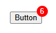

The `attr()` function in CSS is a powerful tool that allows you to dynamically retrieve and display the value of an HTML element's attribute. This can be particularly useful for creating more accessible and dynamic user interfaces.

### What is the `attr()` Function?

The `attr()` function is a CSS function that can be used to retrieve the value of an HTML element's attribute and use it in your CSS styles. The basic syntax is:

```css
selector {
  property: attr(attribute-name);
}
```

Where `attribute-name` is the name of the HTML attribute you want to retrieve the value of.

### Use Cases for `attr()`

#### Dynamic Badge Example

Let's explore a practical example of using `attr()` to create a dynamic badge: 



##### Static Badge Example
In a traditional approach, you might hardcode the badge content within the CSS itself:

```html
<button>Button</button>

<style>
button {
	position: relative;
}

button::before {
	content: "6";

	/* badge styling */
	position: absolute;
	top: -0.75rem;
	right: -0.75rem;
	width: 1.2rem;
	height: 1.2rem;
	display: flex;
	justify-content: center;
	align-items: center;
	border-radius: 50%;
	background-color: red;
	color: white;
}
</style>
```

In this example, the badge always displays the value `6`, making it static and inflexible. This setup does not work well for dynamic content.

##### Making the Badge Dynamic with `attr()`
Instead of hardcoding, you can leverage a custom data attribute to dynamically set the badge value:

```html
<button data-count="8">Button</button>

<style>
button {
	position: relative;
}

button::before {
	content: attr(data-count);
	/* badge styling */
}
</style>
```

Here, the `data-count` attribute holds the badge’s value, allowing you to update it dynamically via JavaScript or server-side rendering without modifying the CSS.

### Advanced Usage and Considerations
#### Fallback Values

```css
.price::before {
    content: attr(data-currency, '$') attr(data-price, '0');
}
```

In this example, if `data-currency` or `data-price` is missing, the respective fallback values (`'$'` and `'0'`) are used instead.

### Conclusion

The CSS `attr()` function offers a flexible way to dynamically incorporate HTML attribute values into your styling. This feature is ideal for creating more responsive, accessible, and data-driven user interfaces. By understanding its capabilities and limitations, you can enhance your web designs with dynamic content seamlessly.