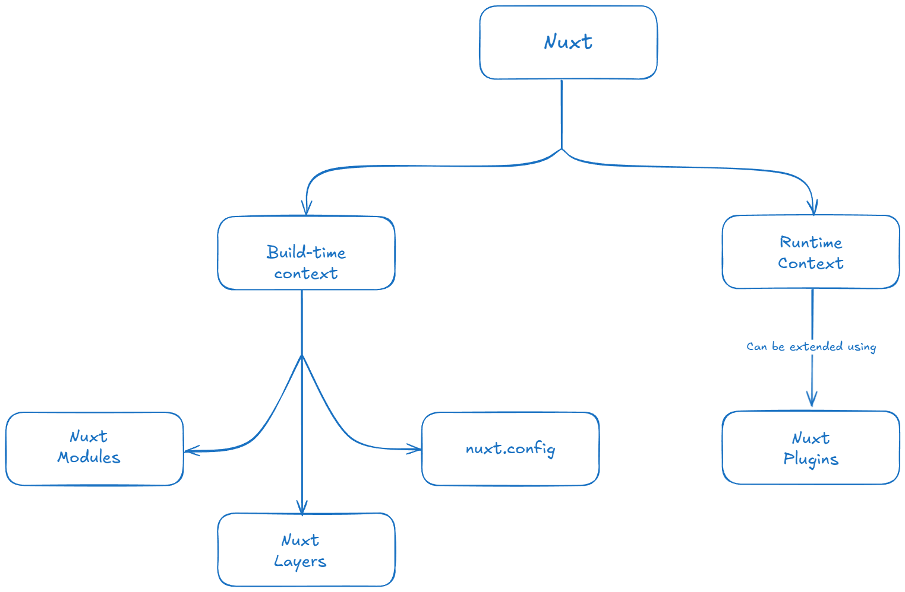

## Introduction

If you've been working with Nuxt.js, especially Nuxt 3, you might have heard about "layers" - one of the framework's most powerful yet sometimes overlooked features. Layers in Nuxt allow developers to extend and organize their applications in a modular and reusable way, making it easier to maintain large projects and share code across multiple applications.

In this comprehensive guide, we'll dive into what Nuxt layers are, why they're useful, and how you can implement them in your projects.

## What Are Nuxt Layers?

**Nuxt Layers** are a high-level construct in Nuxt 3 that allow you to **isolate and reuse parts of your application**, such as components, composables, utilities, and more. Think of them as _composable Nuxt applications_ — you can stack multiple layers together, with each one contributing its own set of functionality.

Each layer can include:
- Components
- Composables
- Pages
- Middleware
- Server routes
- Plugins
- Configuration options
- And more!

What makes layers especially powerful is that they **follow the exact same structure as a regular Nuxt application**, which means they’re intuitive to build and easy to reason about. Unlike traditional package-based solutions, Nuxt Layers integrate deeply with the Nuxt ecosystem — offering full support for features like **hot module replacement (HMR)** and **auto-imports**, without sacrificing the developer experience.

Under the hood, layers are powered by [`c12`](https://github.com/unjs/c12), a configuration loader developed by the [unjs](https://github.com/unjs) team — who maintain many of the core tools that power the Nuxt ecosystem.



## Creating and Using a Nuxt Layer

Let’s start by creating a new Nuxt application:
```bash
pnpx nuxi init <app-name>

# Example:
pnpm nuxi init app 
```

Now, you can add layers to your application with the [nuxt/starter/layer template](https://github.com/nuxt/starter/tree/layer). This will create a basic structure you can build upon. Execute this command within the terminal to get started:

```bash
pnpm nuxi init -t layer <layer-name>

# Examples:
pnpm nuxi init -t layer layer-one
pnpm nuxi init -t layer layer-two
```
This will create folders named `layer-one` and `layer-two`, each containing its own `nuxt.config.ts`, `package.json`, and other optional files like components or composables.
>💡 Alternatively, you can manually create a folder and add a `nuxt.config.ts` file inside it to define a custom layer.

To include these layers in your main Nuxt application, update the `nuxt.config.ts` file in your app - the base app we created:
```ts
// nuxt.config.ts
export default defineNuxtConfig({
  extends: [
    'layer-one',
    'layer-two',
    // Add more layers as needed
	// '@my-themes/awesome',          // Extend from an installed npm package
    // 'github:username/repoName', // Extend from a git repository
  ]
})
```
>Layers are applied in the order they appear in the `extends` array. Later layers can override configurations from earlier ones.

## Overriding Components from Lower Layers

One of the most powerful features of **Nuxt Layers** is the ability to **override components, pages, or configurations** from lower layers. This allows you to customize behavior without modifying the original layer’s source code — perfect for theme customization, white-labeling apps, or extending third-party layers.

When multiple layers contain a component with the **same name** , Nuxt will use the one from the **last (most specific) layer** in the `extends` array of your `nuxt.config.ts`.
###### Example Structure:
```
my-project/
├── app/                  # Your main Nuxt application
│   ├── nuxt.config.ts
│   ├── Button.vue	
│   └── ...               # Pages, components, etc.
├── layer-one/            # First reusable layer
│   ├── nuxt.config.ts
│   ├── Button.vue	
│   └── ...               # Components, composables, config
├── layer-two/            # Second reusable layer
│   └── nuxt.config.ts
└── package.json
```
In this example, the `Button.vue` in the app will override the one from `layer-one`, because the app itself is considered the top-most layer.

If you had two layers like this:
```ts
// nuxt.config.ts
export default defineNuxtConfig({
  extends: [
    '../layer-one',
    '../layer-two'
  ]
})
```
Then any `Button.vue` inside `layer-two` would override the one from `layer-one`.


Let’s say `layer-one` has a reusable component:
```vue
<!-- layer-one/components/Alert.vue -->
<template>
  <div class="bg-yellow-100 p-4">This is a default alert.</div>
</template>
```

Now, in your main app (or another layer that comes after), create a file with the same name:
```vue
<!-- components/Alert.vue -->
<template>
  <div class="bg-red-100 p-4 font-bold">This is a custom alert!</div>
</template>
```
Now, every time `<Alert />` is used in your application, it will render the overridden version from the top layer.

✅ **Pro Tip** : You don’t need to change any imports — Nuxt auto-imports components based on their names, and layers respect this hierarchy.

## Conclusion

Nuxt Layers offer a game-changing approach to building scalable, modular, and reusable web applications. Whether you're looking to extract common UI patterns into a design system, abstract shared logic into a utility layer, or even publish and consume layers via NPM or GitHub, Nuxt makes it seamless and efficient.

By leveraging the layered architecture, you can:

- Build modular applications with clean separation of concerns
- Share functionality across projects without duplication
- Customize third-party or base layers without altering their source
- Improve maintainability and reduce technical debt over time

As the Nuxt ecosystem continues to evolve, layers are becoming a cornerstone feature for modern Nuxt development — especially when combined with tools like `c12` for intelligent configuration loading and extension.

So whether you're starting a new project or refactoring an existing one, **give Nuxt Layers a try** — you might just find yourself building smarter, faster, and more sustainably than ever before.

References:
[Nuxt docs - Layers](https://nuxt.com/docs/guide/going-further/layers)
[Example repo](https://github.com/Sreesanth46/nuxt-layers)

<p style="text-align: center;">fin.</p>