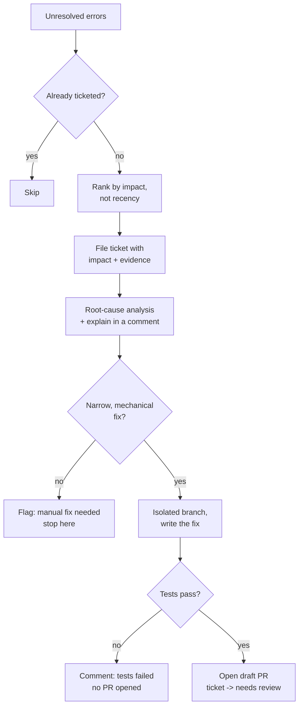

Every team with an error tracker has the same graveyard: hundreds of unresolved issues, usually sorted by “last seen,” that nobody has time to open.

Most of them aren't mysterious. They're often a five-minute read of a stack trace away from a diagnosis.

The problem isn't difficulty. It's **throughput**.

Triage is repetitive, low-glamour work, and it competes for attention with everything else on the sprint.

So I set up a scheduled agent to handle the first pass for me.

Not an agent that tries to fix everything. That's a good way to ship confident nonsense into production.

Instead, it does something deliberately narrower:

1. Find the error actually worth investigating.
2. Check whether it's already being tracked.
3. Create a useful ticket with the relevant context.
4. Investigate and explain the likely root cause.
5. Attempt a fix only when the change is small and obvious.
6. Stop and hand off anything that requires real judgment.

The important part isn't how much the agent can do.

It's **where it knows to stop**.

Here's the pipeline, end to end.

## 1. Pick the right issue

“Newest error” and “worst error” are not the same thing.

Most error trackers default to showing the most recently seen issues. That means something that fired five minutes ago can easily appear above an error that has affected thousands of requests over the last week.

The agent instead ranks unresolved errors by **event volume over a rolling window**.

That gives it a much better signal for impact:

- How often is this actually happening?
- How many users are affected?
- Is this a new issue?
- Has it recently regressed?

I also filter out issues that are already known and actively being handled. Otherwise, the agent ends up repeatedly rediscovering the same problem.

That one change makes a surprisingly large difference.

**Triage should prioritize impact, not recency.**

## 2. Don't file the same bug twice

Before creating anything, the agent checks the issue tracker for tickets already associated with that error.

And this check has to include tickets created by humans, not just tickets created by the agent.

Duplicate tickets are worse than no tickets. They fragment the conversation, split ownership, and make future triage noisier.

The deduplication step isn't particularly exciting, but it's one of the most important pieces of the workflow.

If people start seeing duplicate tickets every time the agent runs, they'll stop trusting it.

## 3. Create a ticket that explains itself

The ticket shouldn't just say:

> Here's a stack trace. Good luck.

It should answer the first questions a developer will have without requiring them to open another dashboard.

I have it lead with **why this issue matters right now**:

- Event count over the analysis window
- Approximate number of affected users
- The error itself
- The relevant stack frame
- A link back to the original error-tracking issue

The goal is simple: someone looking at the ticket later should immediately understand whether they're looking at a rare edge case or something actively affecting a meaningful number of users.

The ticket becomes the working context for the investigation, rather than just another pointer to a different tool.

## 4. Explain the root cause, not just the symptom

Once the ticket exists, the agent investigates why the error is happening.

Ideally, that means using a code-aware root-cause analysis tool.

But those tools have usage limits, and sometimes the answer is simply:

> No budget available right now.

That's not an exceptional failure. It's an expected constraint.

When the higher-level analysis isn't available, the agent falls back to the basics: read the stack trace, inspect the source at the failure point, and trace the call chain manually.

In other words, it does roughly what a developer would do during the first few minutes of an investigation.

Regardless of how the analysis happens, the agent posts the reasoning as a comment on the ticket **before making any decision about a fix**.

That's an important boundary.

The explanation needs to stand on its own. It shouldn't depend on whether the agent eventually decides to modify the code.

A useful ticket should tell a human:

> This is what happened, this is why I think it happened, and this is the evidence supporting that conclusion.

## 5. Decide whether to fix or defer

This is the part that matters most for trust.

The agent is deliberately conservative about making code changes.

It will only attempt an automatic fix when the problem is genuinely narrow and mechanical, such as:

- A missing null check
- An unguarded error path
- A small conditional bug
- A logic gap where the correct behavior is already established elsewhere in the codebase

Anything with a potentially large blast radius gets handed off.

That includes things like:

- Authentication
- Payments
- Data migrations
- Core business logic
- Changes that require architectural decisions
- Anything where the intended behavior isn't obvious

For those, the agent leaves a short note explaining why the issue needs a manual fix and stops.

This is probably the design decision I'd defend hardest.

An agent that occasionally says:

> I'm not touching this.

is far more useful than one that always tries to fix things and occasionally gets them wrong in the parts of the codebase where mistakes are expensive.

The goal isn't maximum automation.

It's **maximum useful automation within a safe boundary**.

## 6. If it writes code, use guardrails — not vibes

When an issue clears the “safe to fix” bar, the agent still doesn't get access to the main branch.

It works in an isolated copy of the repository and creates its own branch.

Then the process is intentionally boring:

1. Make the smallest change that addresses the identified root cause.
2. Run the existing test suite.
3. If tests fail, stop.
4. If tests pass, commit and push the branch.
5. Open a **draft pull request**.
6. Move the ticket to “needs review.”

If anything goes wrong during testing, the agent posts a comment explaining what failed and does **not** open a PR.

If everything passes, the resulting change still isn't merged automatically.

There is always a human looking at the diff.

The agent can investigate.

It can explain.

It can propose a fix.

But it doesn't get to decide that its own work is production-ready.

## The shape of it

## Why this shape works

The instinct with agents doing real work is to ask:

**“How much can it do?”**

I think the more useful question is:

**“Where does it know to stop?”**

This workflow automates the parts of triage that are genuinely mechanical:

- Searching
- Ranking
- Deduplication
- Collecting evidence
- Explaining likely causes
- Matching against known-safe fix patterns
- Running tests

Everything beyond that becomes a human decision.

That's intentional.

The system is designed to **fail closed**.

When the agent isn't confident enough to proceed, it doesn't invent confidence. It explains what it found, says why it stopped, and hands the problem back to a person.

That's a much easier system to trust than one that's merely “usually right.”

You don't need to trust the agent to know when it's wrong.

You only need to trust the boundaries you've put around what happens when it might be.

## The takeaway

None of the individual pieces are particularly exotic.

Issue-tracker queries. Deduplication. Stack-trace analysis. A test run. A branch. A draft PR.

What makes the system useful is the **ordering and the stopping points**:

**Rank by impact.  
Explain before acting.  
Only modify code when the blast radius is small.  
Stop when the decision requires human judgment.**

That's a pattern that goes beyond error triage.

For any agent doing recurring, judgment-adjacent work, the goal shouldn't be to automate the entire process.

Automate the tedious reconnaissance.

Automate the obvious work.

Make the reasoning visible.

And leave the decisions that actually matter to a human.

fin.
