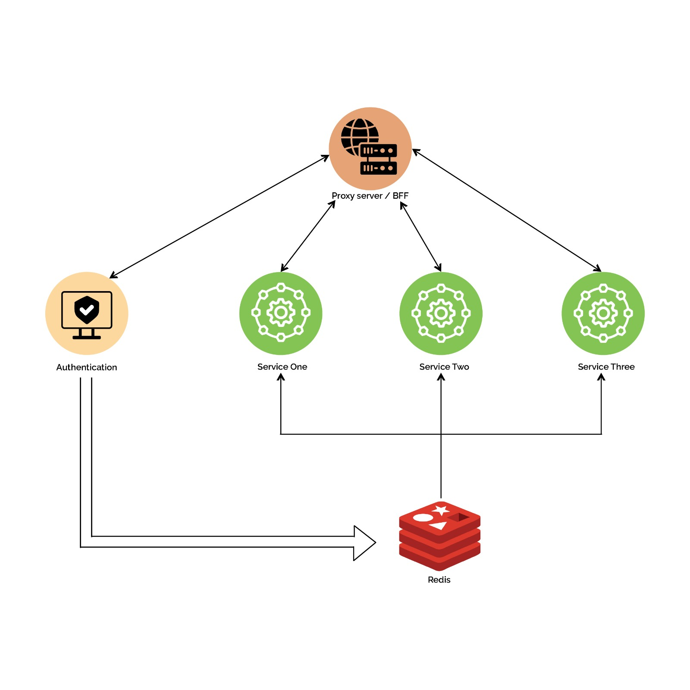

When building applications with microservices, managing user sessions across services can be tricky. A robust session management approach is key to ensuring a smooth user experience. Here is an outline of how to share session state across independent services:

##### Requirements:
- Single sign-on across services
- Ability to invalidate sessions globally

##### Proposed Solution:
1. _Asymmetric JWT Authentications_ - services have the _public key_ to verify tokens signed by the auth service's _private key_.
2. _Shared Redis Cache_ - stores _active access tokens_ 𝘮𝘢𝘱𝘱𝘦𝘥 _to user IDs._ All services can connect to Redis to validate tokens.

##### General Workflow:
- The authentication service generates Access and refresh tokens.
- An endpoint in the authentication service provides the public key for token verification.
- Users can forcefully remove existing sessions during login if needed.

##### When a user logs for the first time:
- Auth service generates signed access and refresh JWT tokens
- Before issuing tokens, the auth service checks Redis for existing tokens with user ID, and raise error if found.
- A new access token is stored in Redis mapped to the user ID, with expiration time as time to leave(TTL).

##### Logging out:
- Auth service invalidates JWT by removing it from Redis. All services now deny access.

##### Refreshing expired token:
- When a user requests an access token with a refresh token, generate a new access token _if none exists in Redis_ (typically when the access token has expired).
- If an access token already exists, raise an error, prompting the user to log in again.

This shared Redis token store allows services to coordinate sign-on state. Storing tokens for validity checks prevents unauthorized use if intercepted.

fin.

